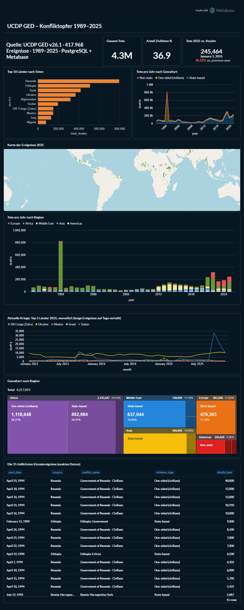
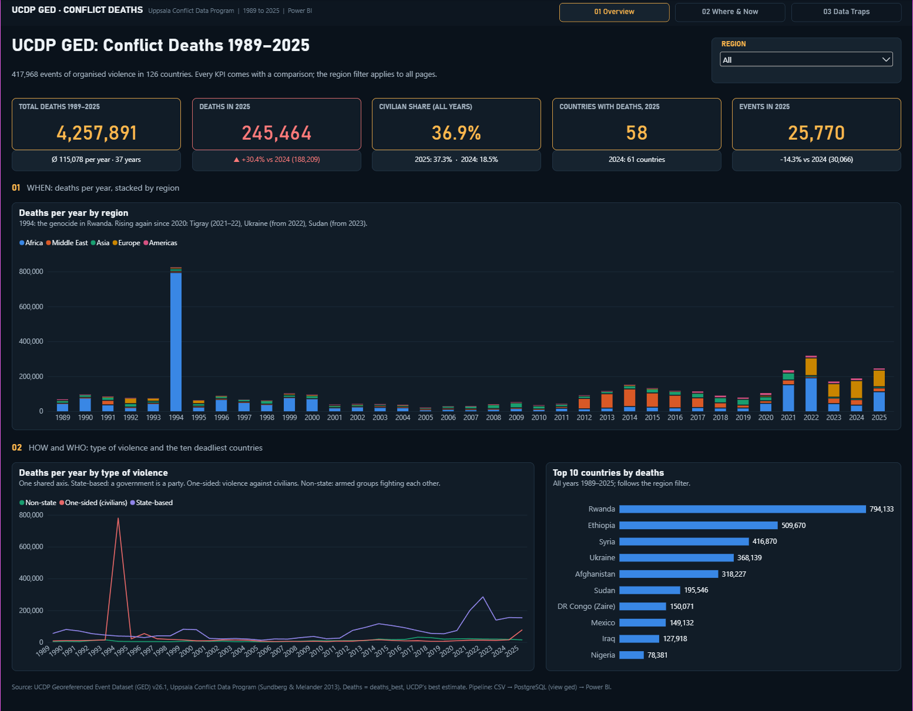
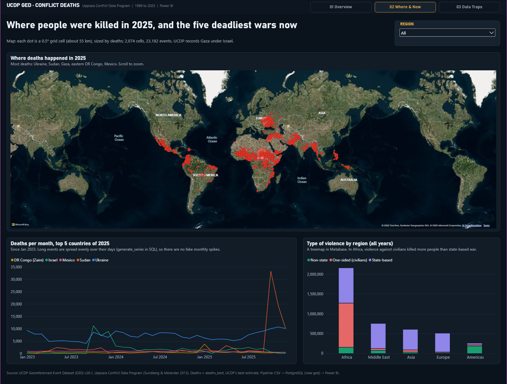
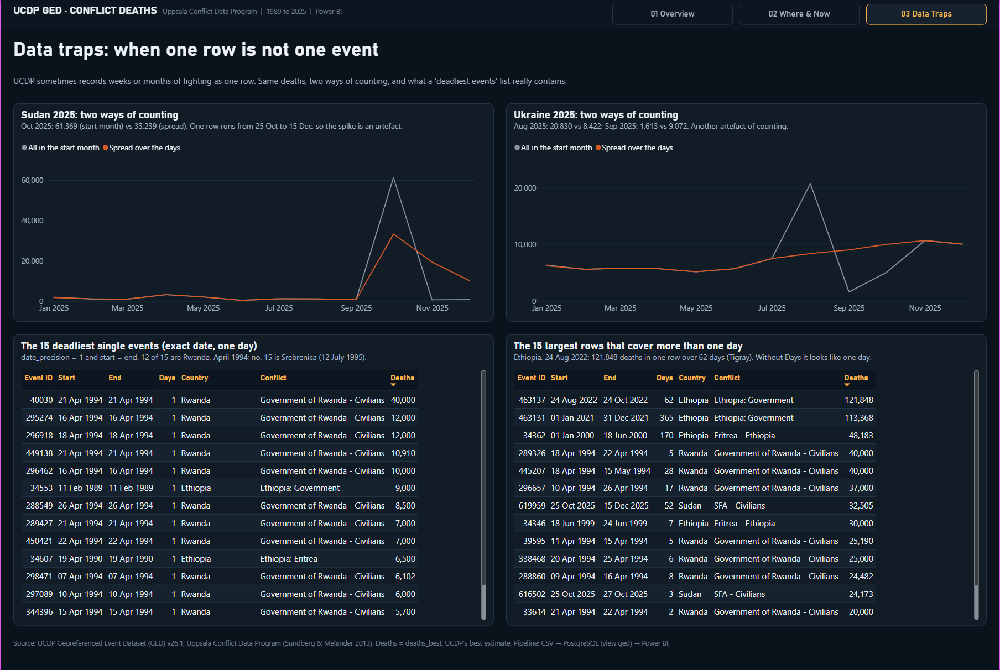

# UCDP Conflict Deaths: one dataset, two BI tools

Every recorded death in organised violence worldwide from 1989 to 2025: **417,968 events in 126 countries,
4,257,891 deaths**. This project loads the UCDP Georeferenced Event Dataset (GED v26.1) into PostgreSQL, explores it
in SQL, and then builds the same dashboard twice: once in **Metabase** and once in **Power BI**.

The most useful lesson was not about either tool. It was about the data: **in UCDP, one row is not always one event.**
See [Data traps](#data-traps) below.

| | Metabase | Power BI |
|---|---|---|
| Built with | 10 SQL questions on one dashboard | Data model + 29 DAX measures, 3 pages |
| Source | PostgreSQL view `ged` | Same view + 3 SQL tables (native queries) |
| Files | [`metabase/queries/`](metabase/queries) | [`powerbi/`](powerbi) (PBIP project) |

## Screenshots

**Metabase** (built first, with German labels)



**Power BI**: Overview, Where & Now, Data Traps





## Pipeline

```
UCDP GED v26.1 (CSV, 417,968 rows)
   -> PostgreSQL: table ged_raw (all text, loaded with psql \copy)
   -> view ged (sql/01_create_view_ged.sql): readable names, real types, violence codes as words
   -> Metabase: one SQL question per chart
   -> Power BI: view ged imported + 3 SQL tables (monthly spread, 2025 map grid, top-event lists)
```

## Key findings

All numbers use `deaths_best`, UCDP's best estimate.

- **1994 is the deadliest year** in the data: 824,177 deaths, almost all of them the genocide in Rwanda.
  Rwanda (794,133), Ethiopia (509,670) and Syria (416,870) have the most deaths since 1989.
- **Civilians are 36.9 %** of all deaths. In 2025 the share was 37.3 %, double 2024's 18.5 %.
- **2025 was 30.4 % deadlier than 2024** (245,464 vs 188,209), even though there were fewer events (25,770 vs 30,066).
- **In 2024 Europe was the deadliest region** (102,375 deaths, almost all in Ukraine). In 2025 Africa was back on top,
  driven by Sudan.
- **The Tigray war in Ethiopia was the deadliest conflict of the decade**: "Ethiopia: Government" was the top conflict
  in 2020, 2021 and 2022, and 2022 (162,453 deaths) is the deadliest single conflict-year since 2015, ahead of every
  year of the Russia-Ukraine war.
- **Country is not the same as conflict.** In 2024 the conflict "Russia - Ukraine" had 102,120 deaths, but
  `country = 'Ukraine'` only 91,779. The difference happened on Russian soil (the Kursk incursion).
- **Gaza is coded under Israel.** Of 14,563 deaths with `country = 'Israel'` in 2025, 14,342 are in the province
  "Gaza Strip". Any "deaths in Israel" ranking is really mostly Gaza.
- **Most events are small**: 89 % have fewer than 10 deaths, and only 322 events have 1,000 or more.

## Data traps

UCDP sometimes records weeks or months of fighting as **one row**, with a start date, an end date and a
`date_precision` code. If you treat each row as a single event on its start date, you get wrong answers.

| Trap | What a naive query says | What is really in the data |
|---|---|---|
| "Deadliest event" | Ethiopia, 24 Aug 2022: 121,848 deaths | One row covering **62 days** of the Tigray offensive |
| "Deadliest day in Ukraine" | 2 Mar 2022: 15,996 deaths | The whole **2-month siege of Mariupol** in one row. With exact dates only, the deadliest day is 16 Mar 2022 (719 deaths, 600 of them in the Mariupol theatre airstrike) |
| Sudan, October 2025 | 61,369 deaths in one month | One row runs from 25 Oct to 15 Dec 2025 (fall of El Fasher). Spread over its days: Oct 33,239 / Nov 19,366 / Dec 10,146 |
| Ukraine, Aug/Sep 2025 | Aug 20,830, Sep 1,613 | Spread over the days: Aug 8,422, Sep 9,072. The August spike is an artefact |
| "Deadliest single events" | Ethiopia and Rwanda rows lasting weeks | With `date_precision = 1` and start = end: 12 of the top 15 are Rwanda, April 1994; number 15 is Srebrenica (12 July 1995). No event after 1995 makes the list |

**The fix** (used in [`powerbi/sql/monthly.sql`](powerbi/sql/monthly.sql) and Metabase query 08): spread every event's
deaths evenly over its days before grouping by month.

```sql
SELECT date_trunc('month', d)::date AS month,
       country,
       SUM(deaths_best::numeric / (end_date - start_date + 1)) AS deaths
FROM ged
CROSS JOIN LATERAL generate_series(start_date, end_date, interval '1 day') AS d
GROUP BY 1, 2;
```

Country totals stay the same (4,257,889 vs 4,257,891, rounding); only the months move.

Other quirks worth knowing:

- 5,075 rows have their low/best/high estimates in the wrong order (from UCDP, left as is and flagged in the view).
- `number_of_sources = -1` means unknown (turned into NULL in the view).
- Bosnia-Herzegovina has 9,208 events with exact coordinates but no province. That is a gap in the coding.
- Importing the CSV: text fields contain backslashes and line breaks, which broke the DBeaver import.
  `psql \copy ... WITH (FORMAT csv, HEADER true, NULL '', ENCODING 'UTF8')` worked.

## Metabase vs Power BI

What I noticed building the same dashboard twice:

| | Metabase | Power BI |
|---|---|---|
| Getting started | One JAR file (Java 21), runs in the browser, connected to PostgreSQL in minutes | Windows desktop app, data model first |
| Way of working | **SQL-first**: write a query, pick a chart, save. Great for exploring | **Model-first**: tables, relationships, DAX measures reused by every visual |
| Comparisons (KPI vs last year) | One "Trend" card per query | Measures like `Deaths YoY %`, used in 5 KPI tiles |
| Filters | Per dashboard, needs SQL variables | One region slicer, synced across all pages |
| Maps | Pin map of raw points | Bing map limited to about 3,500 points, so events were grouped into a 0.5° grid (2,074 cells) |
| Pitfalls I hit | Pivot tables only for GUI questions, not SQL; small categories folded into "Other" | `BLANK <= 5` is true in DAX; tables merge rows without an ID column; the default theme draws smooth (invented) lines |
| Sharing | Free public links, but with a "Made with Metabase" badge and a server you must host | Needs a Pro licence to share; PBIP files work well in Git |

**My take:** Metabase is the faster tool for exploring data with SQL. Power BI is stronger for a finished, multi-page
report with comparisons and shared filters. The data traps were identical in both: no tool fixes them for you.

## Repository layout

```
sql/                  view definition + practice queries (Levels 1-3)
metabase/queries/     the 10 SQL questions behind the Metabase dashboard
powerbi/              Power BI project (.pbip), open with Power BI Desktop
powerbi/sql/          the 3 SQL queries the Power BI model runs (monthly spread, map grid, top events)
images/               screenshots
```

## Reproduce it

1. Download **UCDP GED v26.1** (CSV) from <https://ucdp.uu.se/downloads/> (not included in this repo).
2. Create a PostgreSQL database `world_events`, a table `ged_raw` with all columns as text, and load it with
   `psql \copy ged_raw FROM 'GEDEvent_v26_1.csv' WITH (FORMAT csv, HEADER true, NULL '', ENCODING 'UTF8')`.
   Check: 417,968 rows.
3. Run [`sql/01_create_view_ged.sql`](sql/01_create_view_ged.sql).
4. **Metabase:** `java -jar metabase.jar`, open <http://localhost:3000>, add the PostgreSQL database and paste the
   queries from `metabase/queries/`.
5. **Power BI:** open `powerbi/ged_data_with_powerbi.pbip`, enter your PostgreSQL credentials, approve the three
   native SQL queries, and click Refresh.

## Source

Sundberg, Ralph and Erik Melander (2013). *Introducing the UCDP Georeferenced Event Dataset.* Journal of Peace
Research 50(4). Data: Uppsala Conflict Data Program, UCDP GED v26.1, <https://ucdp.uu.se>.

Built with help from Claude (Anthropic): SQL review, the Power BI report generator and this README.
